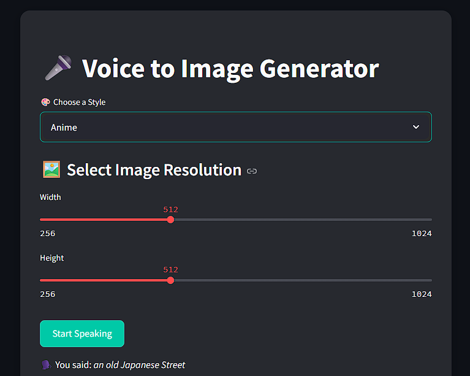
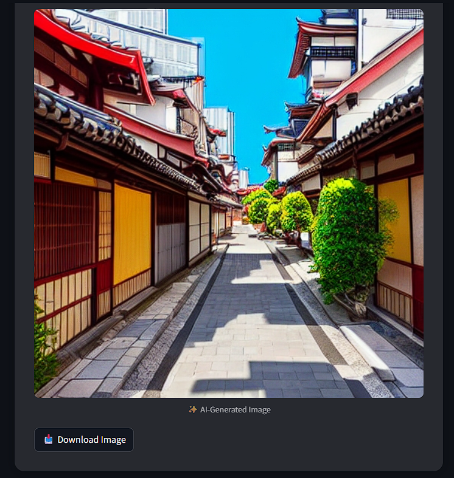

<!DOCTYPE html>
<html lang="en">
<head>
  <meta charset="UTF-8" />
  <title>Voice-to-Image Generator</title>
  
</head>
<body>

<h1>🎤🖼️ Voice-to-Image Generator</h1>

A web-based app that takes either typed text or spoken input and generates an image using Stable Diffusion.
Built with Streamlit, Diffusers, and optional voice support using <code>speech_recognition</code>.

<h2>🌟 Features</h2>
<ul>
  <li>🎙️ Voice-to-text (optional)</li>
  <li>📝 Text input for prompts</li>
  <li>🎨 Style filters (Realistic, Anime, Sketch, etc.)</li>
  <li>📏 Resolution slider</li>
  <li>🔁 Seed control for repeatable images</li>
  <li>🧠 Inference step adjustment</li>
  <li>📥 Download image button</li>
</ul>

<h2>📷 Screenshots</h2>

<em>Replace with your actual screenshots:</em>

<table>
  <tr>
    <td></td>
    <td></td>
  </tr>
</table>

<h2>🧰 Tech Stack</h2>
<ul>
  <li><strong>UI:</strong> Streamlit</li>
  <li><strong>Speech Input:</strong> speech_recognition (local only)</li>
  <li><strong>Image Generation:</strong> Hugging Face Diffusers + Stable Diffusion</li>
  <li><strong>Audio:</strong> HTML + base64</li>
</ul>

<h2>🚀 How to Run Locally</h2>

<h3>🛠️ Prerequisites</h3>
<ul>
  <li>Python 3.9+</li>
  <li>pip</li>
  <li>GPU recommended (CPU also works)</li>
</ul>

<h3>🔧 Clone the Repo</h3>
<pre><code>git clone https://github.com/yourusername/voice-to-image-generator.git
cd voice-to-image-generator</code></pre>

<h3>📦 Install Requirements</h3>
<pre><code>pip install -r requirements.txt</code></pre>

<h3>▶️ Run the App</h3>
<pre><code>streamlit run app.py</code></pre>

Then open your browser to <a href="http://localhost:8501">http://localhost:8501</a>

<h2>☁️ Deploying to Streamlit Cloud</h2>
<ol>
  <li>Push to GitHub</li>
  <li>Go to <a href="https://share.streamlit.io">https://share.streamlit.io</a></li>
  <li>Connect your repo and deploy</li>
</ol>

<strong>Note:</strong> Voice input only works locally. For online, use the text input version.

<h2>📁 Project Structure</h2>
<pre><code>
├── app.py
├── speech_to_text.py
├── image_gen.py
├── beep.mp3
├── requirements.txt
├── README.html
└── screenshots/
</code></pre>

<h2>🙌 Acknowledgements</h2>
<ul>
  <li>Hugging Face Diffusers</li>
  <li>Streamlit</li>
  <li>Stable Diffusion by Stability AI</li>
</ul>

</body>
</html>
